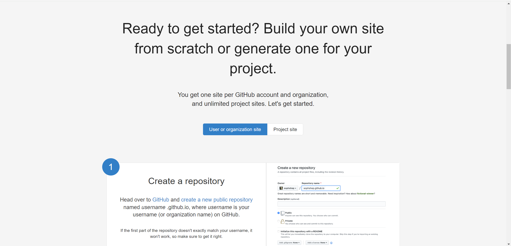
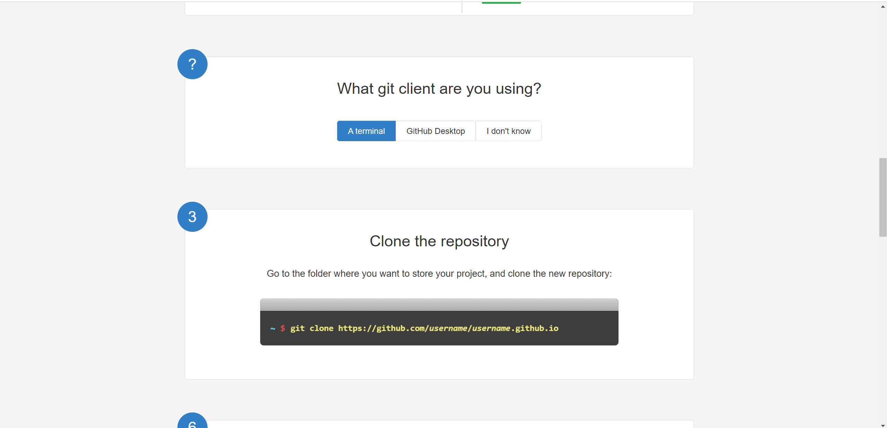
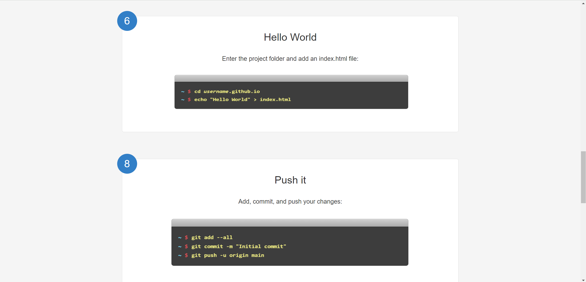
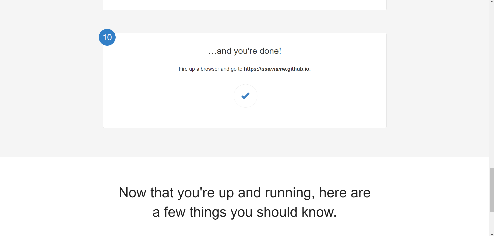

# Clone Website Github Pages (HTML CSS)

## Deskripsi
Proyek ini adalah clone sederhana website Github Pages menggunakan HTML CSS 

## Cara Instalasi

1. Clone repository ini di terminal dengan cara:
    ```bash
    git clone https://github.com/danendradipa/pz-task1-danendra.git
    ```

## Hasil Screenshot







